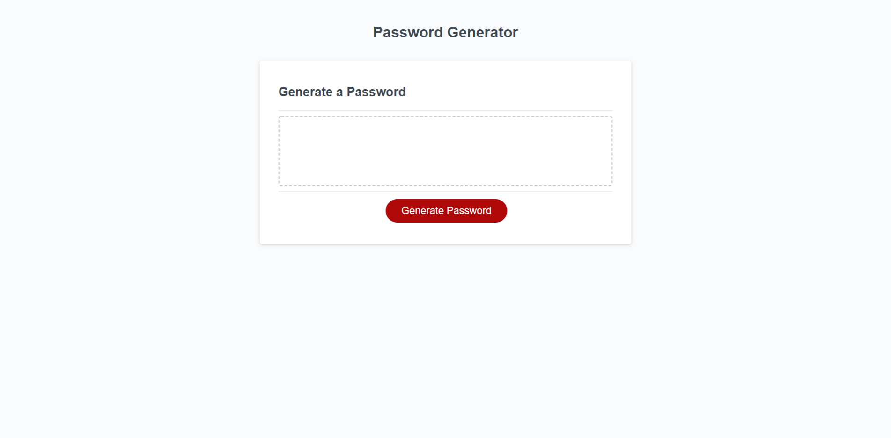

# Secured-Password-Generator

This password generator was created for an employee who was wanting to create a password instead of creating one on their own. It allows the user to choose what kind of characters they would like to use in their password such as uppercase, lowercase, numbers, and special characters. It also allows the user to choose a password length between 8 and 128 characters and will generate a password based on their selections. 

This generator will allow users to feel more secure while using a mix of characters for creating a password and will make it harder for others to figure out the user's new and more secure password.

[View the Password Generator Here](https://danacorona.github.io/Secured-Password-Generator/)

# Screenshot
